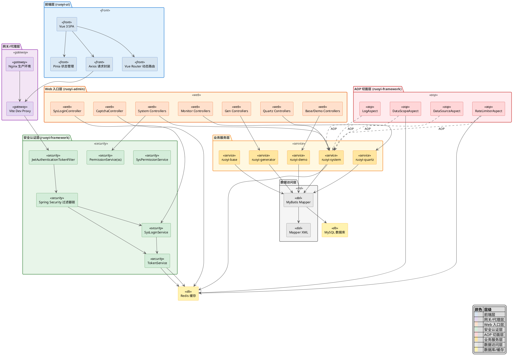
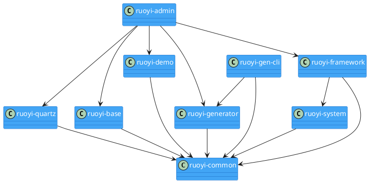
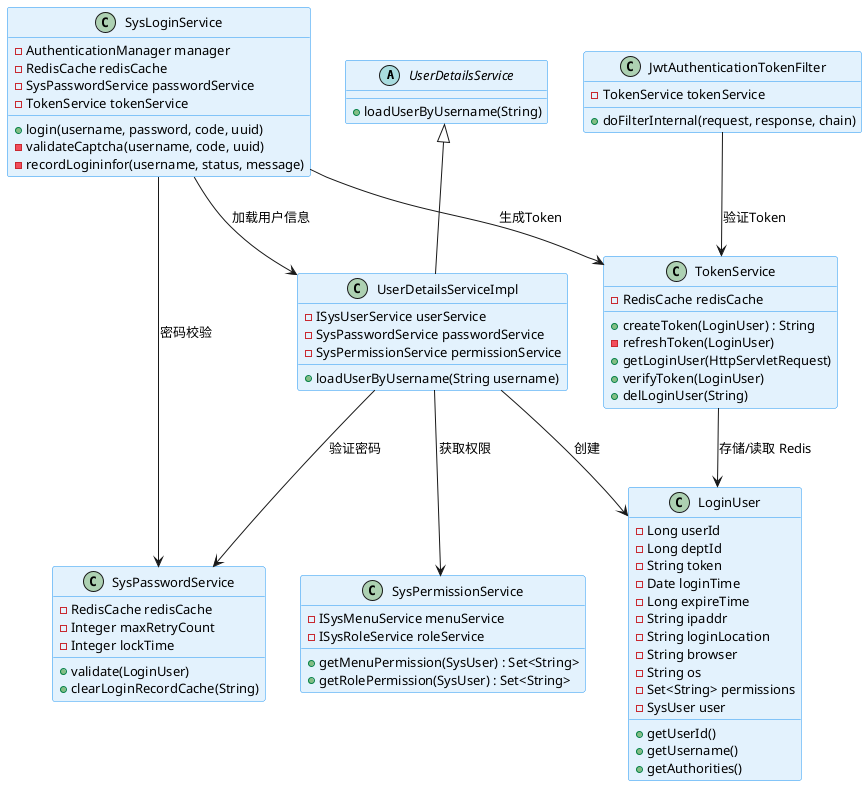
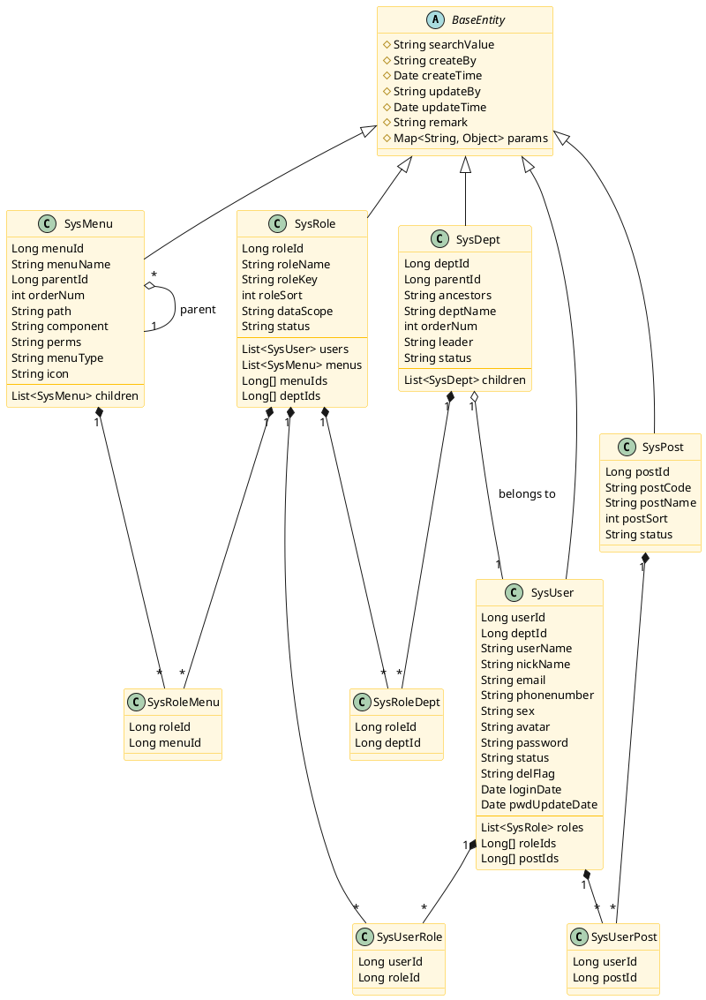
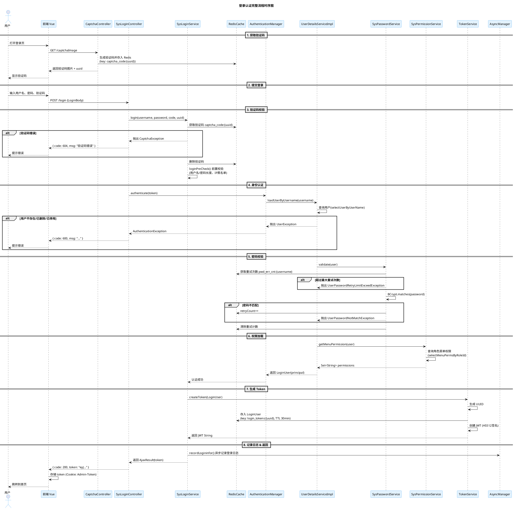
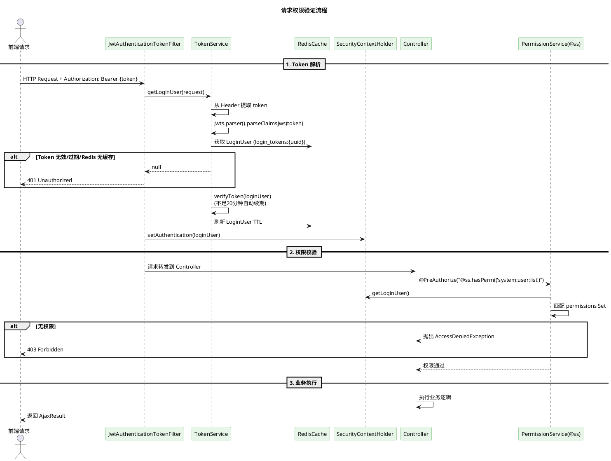
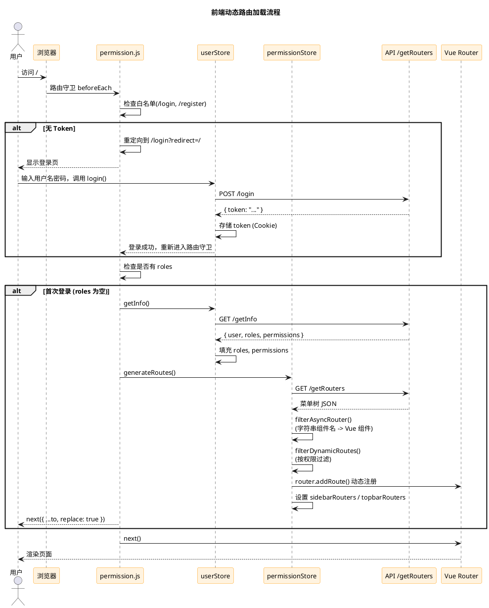
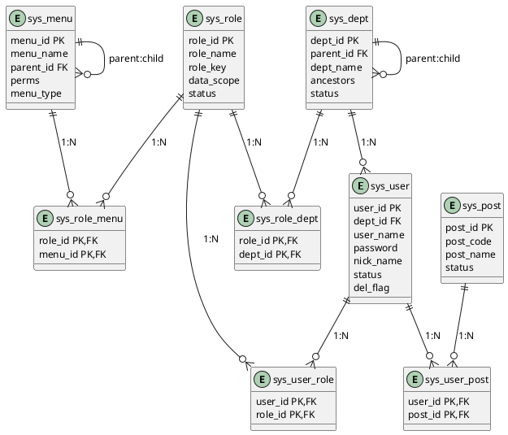

# 01 系统架构分析文档

## 一、技术架构全景图

### 1.1 技术栈总览

| 层级 | 技术 | 版本 |
|------|------|------|
| 后端框架 | Spring Boot | 4.0.3 |
| JDK | Oracle/OpenJDK | 17 |
| 安全框架 | Spring Security | 4.x (Spring Boot 内置) |
| 持久层 | MyBatis | 4.0.1 (mybatis-spring-boot) |
| 数据库连接池 | Alibaba Druid | 1.2.28 |
| 数据库 | MySQL | 5.7+ |
| 缓存 | Redis (Lettuce) | 6.1.0 (Spring Boot 内置) |
| 分页 | PageHelper | 2.1.1 |
| JSON | Fastjson2 | 2.0.61 |
| Token | JJWT | 0.9.1 |
| API 文档 | SpringDoc (OpenAPI3) | 3.0.2 |
| 验证码 | Kaptcha | 2.3.3 |
| 代码生成 | Velocity | 2.3 |
| Excel | Apache POI | 4.1.2 |
| 系统监控 | Oshi | 6.10.0 |
| 前端框架 | Vue | 3.5.26 |
| 构建工具 | Vite | 6.4.1 |
| UI 组件库 | Element Plus | 2.13.1 |
| 状态管理 | Pinia | 3.0.4 |
| HTTP 客户端 | Axios | 1.13.2 |
| 数据可视化 | ECharts | 5.6.0 |

### 1.2 架构全景组件图




---

## 二、模块依赖关系

### 2.1 模块自底向上依赖

```
ruoyi-common (基础工具层)
    ↑
ruoyi-system (系统业务层，依赖 common)
    ↑
ruoyi-framework (框架核心层，依赖 system + common)
    ↑
ruoyi-admin (Web 入口层，依赖 framework + system + common + quartz + generator + demo + base)

ruoyi-quartz (定时任务，依赖 common)
ruoyi-generator (代码生成，依赖 common)
ruoyi-gen-cli (CLI 工具，依赖 generator + common)
ruoyi-demo (示例模块，依赖 common)
ruoyi-base (基础业务模块，依赖 common)
```

### 2.2 模块依赖图



---

## 三、核心类关系

### 3.1 认证体系类图



### 3.2 数据实体类图



---

## 四、登录认证时序图



---

## 五、权限验证时序图（请求进入）



---

## 六、核心配置类说明

### 6.1 ruoyi-framework 配置类

| 配置类 | 包路径 | 作用 |
|--------|--------|------|
| `ApplicationConfig` | `com.ruoyi.framework.config` | 参数校验器 Validator 配置 |
| `CaptchaConfig` | `com.ruoyi.framework.config` | Kaptcha 验证码生产者配置（math/char 两种模式） |
| `DruidConfig` | `com.ruoyi.framework.config` | Druid 数据源配置 + 动态数据源注册 + Druid 监控去广告 |
| `FilterConfig` | `com.ruoyi.framework.config` | 注册 XSSFilter、RefererFilter、RepeatableFilter |
| `I18nConfig` | `com.ruoyi.framework.config` | 国际化资源加载 |
| `MyBatisConfig` | `com.ruoyi.framework.config` | SqlSessionFactory 配置，Mapper XML 解析 |
| `RedisConfig` | `com.ruoyi.framework.config` | RedisTemplate 配置 + 限流 Lua 脚本加载 |
| `ResourcesConfig` | `com.ruoyi.framework.config` | WebMvc 配置：静态资源映射、拦截器、CORS |
| `SecurityConfig` | `com.ruoyi.framework.config` | Spring Security 过滤器链配置 |
| `ThreadPoolConfig` | `com.ruoyi.framework.config` | 异步线程池（核心50、最大200、队列1000） |

### 6.2 application.yml 核心配置

| 配置项 | 值 | 说明 |
|--------|-----|------|
| `server.port` | 18080 | 后端服务端口 |
| `ruoyi.version` | 3.9.2 | 项目版本 |
| `ruoyi.profile` | `/home/workspace/com/wfxx-vue3/upload_path` | 文件上传路径 |
| `token.expireTime` | 30 (分钟) | JWT Token 有效期 |
| `user.password.maxRetryCount` | 5 | 密码最大错误次数 |
| `user.password.lockTime` | 10 (分钟) | 密码锁定时间 |
| `mybatis.typeAliasesPackage` | `com.ruoyi.**.domain` | MyBatis 别名扫描 |
| `xss.enabled` | true | XSS 防护开关 |
| `spring.data.redis.password` | lihaidong | Redis 密码 |

---

## 七、前端架构时序图

### 7.1 前端路由加载流程



---

## 八、数据库表关系

### 8.1 系统核心表

| 表名 | 说明 | 主键 |
|------|------|------|
| `sys_user` | 用户表 | user_id |
| `sys_role` | 角色表 | role_id |
| `sys_menu` | 菜单表 | menu_id |
| `sys_dept` | 部门表 | dept_id |
| `sys_post` | 岗位表 | post_id |
| `sys_user_role` | 用户-角色关联 | user_id + role_id |
| `sys_role_menu` | 角色-菜单关联 | role_id + menu_id |
| `sys_role_dept` | 角色-部门关联 | role_id + dept_id |
| `sys_user_post` | 用户-岗位关联 | user_id + post_id |
| `sys_dict_type` | 字典类型 | dict_id |
| `sys_dict_data` | 字典数据 | dict_code |
| `sys_config` | 参数配置 | config_id |
| `sys_logininfor` | 登录日志 | info_id |
| `sys_oper_log` | 操作日志 | oper_id |
| `sys_notice` | 通知公告 | notice_id |
| `sys_notice_read` | 公告已读记录 | notice_id + user_id |
| `sys_job` | 定时任务 | job_id |
| `sys_job_log` | 任务日志 | job_log_id |
| `gen_table` | 代码生成表 | table_id |
| `gen_table_column` | 代码生成列 | column_id |
| `sys_area` | 行政区划 | code |

### 8.2 数据库表关系图


