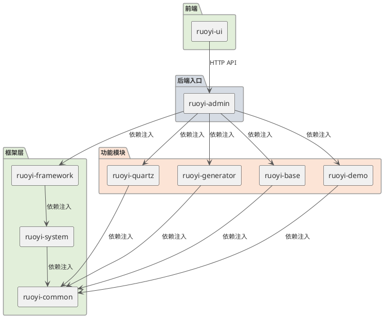
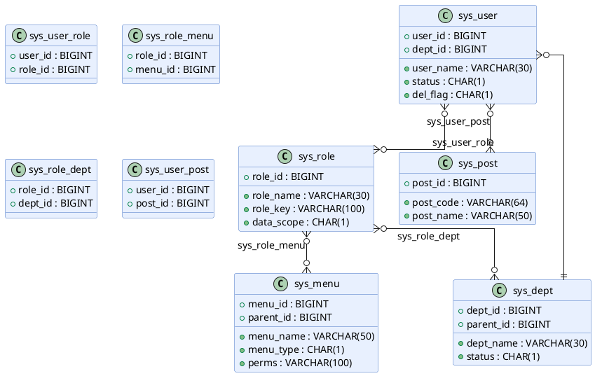

# RuoYi-Vue 项目开发指南

> 版本：3.9.2 | 更新日期：2026-04-15

本文档为 RuoYi-Vue 项目的综合开发指南，涵盖项目概述、环境配置、功能模块说明、API 接口文档、数据模型定义、开发规范及常见问题解决方案，旨在帮助开发团队协作、项目维护及新成员快速上手。

---

## 目录

1. [项目概述](#1-项目概述)
   - 1.1 [项目背景](#11-项目背景)
   - 1.2 [项目目标](#12-项目目标)
   - 1.3 [主要功能](#13-主要功能)
   - 1.4 [技术栈概览](#14-技术栈概览)
2. [环境配置指南](#2-环境配置指南)
   - 2.1 [开发环境要求](#21-开发环境要求)
   - 2.2 [后端环境搭建](#22-后端环境搭建)
   - 2.3 [前端环境搭建](#23-前端环境搭建)
   - 2.4 [Docker 环境配置](#24-docker-环境配置)
   - 2.5 [配置文件设置](#25-配置文件设置)
3. [功能模块说明](#3-功能模块说明)
   - 3.1 [模块总览](#31-模块总览)
   - 3.2 [ruoyi-admin（入口服务模块）](#32-ruoyi-admin入口服务模块)
   - 3.3 [ruoyi-common（通用工具模块）](#33-ruoyi-common通用工具模块)
   - 3.4 [ruoyi-framework（框架核心模块）](#34-ruoyi-framework框架核心模块)
   - 3.5 [ruoyi-system（系统业务模块）](#35-ruoyi-system系统业务模块)
   - 3.6 [ruoyi-quartz（定时任务模块）](#36-ruoyi-quartz定时任务模块)
   - 3.7 [ruoyi-generator（代码生成器模块）](#37-ruoyi-generator代码生成器模块)
   - 3.8 [ruoyi-gen-cli（CLI 代码生成工具）](#38-ruoyi-gen-cli-cli-代码生成工具)
   - 3.9 [ruoyi-base（自定义基础信息模块）](#39-ruoyi-base自定义基础信息模块)
   - 3.10 [ruoyi-demo（示例模块）](#310-ruoyi-demo示例模块)
   - 3.11 [ruoyi-ui（前端模块）](#311-ruoyi-ui前端模块)
   - 3.12 [模块间交互关系](#312-模块间交互关系)
4. [API 接口文档](#4-api-接口文档)
   - 4.1 [接口规范](#41-接口规范)
   - 4.2 [认证接口](#42-认证接口)
   - 4.3 [系统管理接口](#43-系统管理接口)
   - 4.4 [监控管理接口](#44-监控管理接口)
   - 4.5 [定时任务接口](#45-定时任务接口)
   - 4.6 [代码生成接口](#46-代码生成接口)
   - 4.7 [自定义业务接口](#47-自定义业务接口)
   - 4.8 [通用接口](#48-通用接口)
   - 4.9 [权限控制](#49-权限控制)
5. [数据模型定义](#5-数据模型定义)
   - 5.1 [数据库概述](#51-数据库概述)
   - 5.2 [系统核心表](#52-系统核心表)
   - 5.3 [定时任务表](#53-定时任务表)
   - 5.4 [代码生成表](#54-代码生成表)
   - 5.5 [自定义业务表](#55-自定义业务表)
   - 5.6 [索引设计](#56-索引设计)
   - 5.7 [数据关系图](#57-数据关系图)
6. [开发规范](#6-开发规范)
   - 6.1 [代码风格](#61-代码风格)
   - 6.2 [命名规范](#62-命名规范)
   - 6.3 [版本控制流程](#63-版本控制流程)
   - 6.4 [提交信息格式](#64-提交信息格式)
   - 6.5 [分支管理](#65-分支管理)
7. [常见问题解决方案](#7-常见问题解决方案)
   - 7.1 [环境搭建问题](#71-环境搭建问题)
   - 7.2 [数据库连接问题](#72-数据库连接问题)
   - 7.3 [Redis 连接问题](#73-redis-连接问题)
   - 7.4 [前端构建问题](#74-前端构建问题)
   - 7.5 [跨域问题](#75-跨域问题)
   - 7.6 [Token 过期处理](#76-token-过期处理)
   - 7.7 [性能优化建议](#77-性能优化建议)
   - 7.8 [错误处理方法](#78-错误处理方法)

---

## 1 项目概述

### 1.1 项目背景

RuoYi-Vue 是一个基于 Spring Boot + Vue 3 的前后端分离快速开发框架，版本号为 3.9.2。本项目（wfxx-vue3）在 RuoYi-Vue 基础上进行定制化扩展，旨在为企业提供一套开箱即用的基础管理后台解决方案。

项目采用模块化架构设计，后端包含 8 个模块（7 个官方模块 + 1 个自定义业务模块），前端 1 个模块，覆盖用户管理、角色权限、菜单管理、部门管理、岗位管理、字典管理、参数配置、通知公告、定时任务、代码生成、服务器监控等核心功能。

### 1.2 项目目标

- **快速开发**：提供完善的代码生成器（GUI + CLI 两种模式），减少重复 CRUD 代码编写
- **开箱即用**：内置系统管理、权限控制、日志记录、缓存管理、监控等基础功能
- **模块化架构**：各模块职责清晰，依赖关系明确，便于扩展和维护
- **规范化开发**：制定完整的编码规范、API 设计规范、提交规范、测试规范
- **前后端分离**：后端提供 RESTful API，前端通过 JWT Token 认证，支持动态路由加载

### 1.3 主要功能

| 功能域 | 功能描述 |
|--------|----------|
| 用户管理 | 用户 CRUD、导入导出、角色分配、密码重置、在线状态管理 |
| 角色管理 | 角色 CRUD、菜单权限分配、数据权限设置、用户授权 |
| 菜单管理 | 菜单/按钮权限 CRUD、菜单树形展示、图标选择、路由配置 |
| 部门管理 | 部门 CRUD、树形结构、负责人/联系电话/邮箱管理 |
| 岗位管理 | 岗位 CRUD、用户岗位关联 |
| 字典管理 | 字典类型/数据 CRUD、字典标签/值管理、前端 DictTag 组件 |
| 参数配置 | 系统参数 CRUD、配置键值管理、缓存同步 |
| 通知公告 | 公告 CRUD、富文本编辑、已读记录追踪 |
| 行政区划 | 行政区划树形管理、支持懒加载、真实行政区划数据 |
| 设备型号管理 | 设备型号 CRUD、导出功能（自定义业务模块） |
| 操作日志 | 操作记录、请求参数/返回值记录、异常信息记录 |
| 登录日志 | 登录成功/失败记录、IP/浏览器信息 |
| 在线用户 | 在线用户列表、强制下线 |
| 服务器监控 | CPU/内存/磁盘/JVM 信息展示 |
| 缓存监控 | Redis 缓存信息查看 |
| 定时任务 | 任务 CRUD、Cron 表达式管理、任务执行/暂停/恢复、执行日志 |
| 代码生成 | 数据库表导入、代码预览/下载/生成、Velocity 模板引擎 |
| 个人中心 | 个人信息修改、密码修改、头像上传 |
| 用户注册/登录 | 用户名密码登录、验证码校验、用户注册 |

### 1.4 技术栈概览

**后端技术栈**：

| 技术 | 版本 | 用途 |
|------|------|------|
| Spring Boot | 4.0.3 | 核心框架 |
| JDK | 17 | 运行环境 |
| MyBatis Spring Boot | 4.0.1 | ORM 框架 |
| MySQL Connector/J | 8.x | 数据库驱动 |
| Druid | 1.2.28 | 数据库连接池 |
| Redis (Lettuce) | - | 缓存/会话存储 |
| PageHelper | 2.1.1 | 分页插件 |
| JWT (jjwt) | 0.9.1 | Token 生成/验证 |
| FastJSON2 | 2.0.61 | JSON 序列化 |
| Spring Security | 4.x | 安全框架 |
| AspectJ | 1.9.25.1 | AOP 切面 |
| Quartz | via Spring Boot Starter | 定时任务调度 |
| Velocity | 2.3 | 代码生成模板引擎 |
| POI | 4.1.2 | Excel 导入导出 |
| SpringDoc (OpenAPI 3) | 3.0.2 | API 文档 |
| Kaptcha | 2.3.3 | 验证码生成 |
| Oshi | - | 系统信息采集 |

**前端技术栈**：

| 技术 | 版本 | 用途 |
|------|------|------|
| Vue | 3.5.26 | 核心框架 |
| Vite | 6.4.1 | 构建工具 |
| Element Plus | 2.13.1 | UI 组件库 |
| Vue Router | 4.6.4 | 路由管理 |
| Pinia | 3.0.4 | 状态管理 |
| Axios | 1.13.2 | HTTP 请求 |
| ECharts | 5.6.0 | 图表可视化 |
| pnpm | - | 包管理器 |

---

## 2 环境配置指南

### 2.1 开发环境要求

| 软件 | 最低版本 | 推荐版本 | 说明 |
|------|----------|----------|------|
| JDK | 17 | 17 LTS | 必须为 JDK 17 或以上 |
| Maven | 3.6 | 3.9+ | 项目构建工具 |
| Node.js | 18 | 20 LTS | 前端运行环境 |
| pnpm | 8 | 9+ | 前端包管理器 |
| MySQL | 8.0 | 8.0+ | 数据库 |
| Redis | 6 | 7+ | 缓存服务 |
| Docker | 20 | 最新稳定版 | 可选，用于容器化部署 |

### 2.2 后端环境搭建

**步骤 1：安装 JDK 17**

```bash
# 检查 JDK 版本
java -version

# 如未安装，使用 apt 安装（Ubuntu/Debian）
sudo apt update
sudo apt install openjdk-17-jdk

# 设置 JAVA_HOME（添加到 ~/.bashrc 或 ~/.zshrc）
export JAVA_HOME=/usr/lib/jvm/java-17-openjdk-amd64
export PATH=$JAVA_HOME/bin:$PATH
```

**步骤 2：安装 Maven**

```bash
# 检查 Maven 版本
mvn -version

# 如未安装
sudo apt install maven
```

**步骤 3：克隆项目**

```bash
git clone <repository-url> /home/workspace/com/wfxx-vue3
cd /home/workspace/com/wfxx-vue3
```

**步骤 4：构建项目**

```bash
# 完整构建（清理 + 编译 + 跳过测试）
scripts/build.sh -q

# 安装到本地 Maven 仓库
scripts/build.sh -i

# 构建指定模块
scripts/build.sh -m ruoyi-admin
```

**步骤 5：启动后端服务**

```bash
# 前台运行
scripts/run-backend.sh

# 后台运行（等待启动完成）
scripts/run-backend.sh -d

# 查看状态
scripts/run-backend.sh --status

# 健康检查
scripts/run-backend.sh --health

# 停止服务
scripts/run-backend.sh -s

# 重启服务
scripts/run-backend.sh -r
```

启动成功后，后端服务监听端口 `18080`，Swagger 文档地址：`http://localhost:18080/swagger-ui.html`

### 2.3 前端环境搭建

**步骤 1：安装 Node.js**

```bash
# 推荐使用 nvm 管理 Node.js 版本
curl -o- https://raw.githubusercontent.com/nvm-sh/nvm/v0.39.7/install.sh | bash
source ~/.bashrc
nvm install 20
nvm use 20

# 验证安装
node -v
npm -v
```

**步骤 2：安装 pnpm**

```bash
npm install -g pnpm
pnpm -v
```

**步骤 3：安装依赖**

```bash
cd ruoyi-ui

# 方式一：使用脚本
cd ..
scripts/run-frontend.sh -i

# 方式二：手动安装
cd ruoyi-ui
pnpm install
```

**步骤 4：启动前端服务**

```bash
# 方式一：使用脚本
scripts/run-frontend.sh

# 方式二：手动启动
cd ruoyi-ui
pnpm dev
```

启动成功后，前端服务监听端口 `3888`，访问地址：`http://localhost:3888`

### 2.4 Docker 环境配置

项目使用 Docker 运行 MySQL 和 Redis 服务。

**启动 MySQL 容器**

```bash
docker restart mysql8

# 连接信息
# 主机: localhost
# 端口: 3306
# 数据库: ry-vue
# 用户名: root
# 密码: lihaidong
```

**启动 Redis 容器**

```bash
docker restart redis8

# 连接信息
# 主机: localhost
# 端口: 6379
# 密码: lihaidong
# Database: 0
```

**检查容器状态**

```bash
docker ps | grep -E "mysql8|redis8"
```

### 2.5 配置文件设置

#### 2.5.1 后端主配置文件

文件路径：`ruoyi-admin/src/main/resources/application.yml`

```yaml
server:
  port: 18080                          # 服务端口

ruoyi:
  version: 3.9.2                       # 项目版本
  profile: /home/workspace/com/wfxx-vue3/upload_path  # 文件上传路径
  captcha:
    type: math                         # 验证码类型：math（数字计算）

spring:
  data:
    redis:
      host: localhost
      port: 6379
      password: lihaidong
      database: 0
  servlet:
    multipart:
      max-file-size: 10MB              # 单文件上传大小
      max-request-size: 20MB           # 总上传大小

ruoyi:
  token:
    header: Authorization              # Token 请求头
    expireTime: 30                     # Token 有效期（分钟）

mybatis:
  typeAliasesPackage: com.ruoyi.**.domain   # 实体别名扫描
  mapperLocations: classpath*:mapper/**/*Mapper.xml  # Mapper XML 扫描

springdoc:
  api-docs:
    enabled: true                      # 开启 swagger
```

#### 2.5.2 数据库配置文件

文件路径：`ruoyi-admin/src/main/resources/application-druid.yml`

```yaml
spring:
  datasource:
    type: com.alibaba.druid.pool.DruidDataSource
    driverClassName: com.mysql.cj.jdbc.Driver
    druid:
      master:
        url: jdbc:mysql://localhost:3306/ry-vue?useUnicode=true&characterEncoding=utf8&zeroDateTimeBehavior=convertToNull&useSSL=true&serverTimezone=GMT%2B8
        username: root
        password: lihaidong
      slave:
        enabled: false                 # 从库默认关闭
      initialSize: 5                   # 初始连接数
      minIdle: 10                      # 最小空闲连接数
      maxActive: 20                    # 最大活跃连接数
      timeBetweenEvictionRunsMillis: 60000   # 配置间隔多久检测需要关闭的空闲连接
      minEvictableIdleTimeMillis: 300000     # 配置一个连接在池中最小生存时间
      maxEvictableIdleTimeMillis: 900000     # 最大生存时间
      validationQuery: SELECT 1 FROM DUAL
      testWhileIdle: true
      testOnBorrow: false
      testOnReturn: false
      poolPreparedStatements: true
      maxPoolPreparedStatementPerConnectionSize: 20
      filters: stat,wall               # 监控统计 + SQL 防火墙
      connectionProperties: druid.stat.mergeSql\=true;druid.stat.slowSqlMillis\=1000  # 慢 SQL 1000ms
      webStatFilter:
        enabled: true
      statViewServlet:
        enabled: true
        allow:
        url-pattern: /druid/*
        login-username: coderlee       # Druid 监控登录
        login-password: lihaidong
```

#### 2.5.3 前端环境配置

前端开发服务器端口配置在 `ruoyi-ui/vite.config.js` 中，开发端口为 `3888`，代理配置指向后端 `http://localhost:18080`。

---

## 3 功能模块说明

### 3.1 模块总览

项目共包含 **8 个后端模块 + 1 个前端模块**，模块依赖关系如下：

```
ruoyi-admin（入口，依赖 framework, quartz, generator, demo, base）
    |
    +-- ruoyi-framework（框架核心，依赖 system）
    |       |
    |       +-- ruoyi-system（系统业务，依赖 common）
    |               |
    |               +-- ruoyi-common（通用工具，无依赖）
    |
    +-- ruoyi-quartz（定时任务，依赖 common）
    |
    +-- ruoyi-generator（代码生成器，依赖 common）
    |
    +-- ruoyi-gen-cli（CLI 工具，依赖 generator）
    |
    +-- ruoyi-demo（示例，依赖 common）
    |
    +-- ruoyi-base（自定义业务，依赖 common）
    |
ruoyi-ui（前端，独立运行，通过 HTTP API 与后端交互）
```

### 3.2 ruoyi-admin（入口服务模块）

**路径**：`ruoyi-admin/`
**依赖**：ruoyi-framework, ruoyi-quartz, ruoyi-generator, ruoyi-demo, ruoyi-base

**职责**：

- Spring Boot 应用入口（`com.ruoyi.RuoYiApplication`）
- 所有 Controller 层接口定义
- 配置文件管理（application.yml, application-druid.yml, logback.xml）
- SQL 脚本管理（sql/ 目录）

**Controller 分布**：

| 目录 | 职责 |
|------|------|
| `web/controller/system/` | 系统管理：用户、角色、菜单、部门、岗位、字典、配置、公告、区域、登录、注册、个人中心 |
| `web/controller/common/` | 通用接口：验证码、文件上传下载 |
| `web/controller/monitor/` | 监控接口：操作日志、登录日志、在线用户、服务器信息、缓存 |
| `web/controller/tool/` | 工具接口：代码生成 |
| `web/core/config/` | Swagger 配置 |

### 3.3 ruoyi-common（通用工具模块）

**路径**：`ruoyi-common/`
**Java 文件数**：110 个
**依赖**：无

**职责**：提供所有模块共用的工具类、注解、异常、常量等

**核心包结构**：

| 包路径 | 职责 | 关键类/注解 |
|--------|------|-------------|
| `annotation/` | 自定义注解 | @RateLimiter, @Log, @Excel, @DataScope, @DataSource, @Sensitive, @Anonymous, @RepeatSubmit, @Xss |
| `constant/` | 常量定义 | HttpStatus, Constants, UserConstants, CacheConstants, ScheduleConstants, GenConstants |
| `core/controller/` | 控制器基类 | BaseController |
| `core/domain/` | 通用领域对象 | AjaxResult, R, BaseEntity, TreeEntity, TreeSelect |
| `core/domain/entity/` | 系统实体 | SysUser, SysRole, SysMenu, SysDictData, SysDictType, SysDept |
| `core/domain/model/` | 登录模型 | LoginUser, LoginBody, RegisterBody |
| `core/page/` | 分页模型 | TableDataInfo, PageDomain, TableSupport |
| `core/redis/` | Redis 工具 | RedisCache |
| `core/text/` | 字符串处理 | Convert, StrFormatter, CharsetKit |
| `enums/` | 枚举定义 | LimitType, UserStatus, DataSourceType, HttpMethod, BusinessStatus, BusinessType, OperatorType |
| `exception/` | 异常类 | ServiceException, GlobalException, BaseException, FileException, UserException |
| `filter/` | 过滤器 | XssFilter, RepeatableFilter, RefererFilter |
| `utils/` | 工具类集合 | ServletUtils, StringUtils, DateUtils, SecurityUtils, DesensitizedUtil 等 |
| `utils/poi/` | Excel 工具 | ExcelUtil |
| `utils/sign/` | 签名工具 | Md5Utils, Base64 |
| `utils/http/` | HTTP 工具 | HttpHelper, HttpUtils, UserAgentUtils |
| `xss/` | XSS 防护 | XSS 验证相关 |

### 3.4 ruoyi-framework（框架核心模块）

**路径**：`ruoyi-framework/`
**Java 文件数**：45 个
**依赖**：ruoyi-system

**职责**：安全配置、拦截器、AOP 切面、数据源管理、异常处理

**核心组件**：

| 组件 | 类/包 | 职责 |
|------|-------|------|
| 安全配置 | `config/SecurityConfig` | Spring Security 配置、JWT 过滤器链、CORS 配置 |
| Redis 配置 | `config/RedisConfig` | RedisTemplate 配置、FastJSON2 序列化器 |
| MyBatis 配置 | `config/MyBatisConfig` | SqlSessionFactory 配置、分页插件 |
| Druid 配置 | `config/DruidConfig` | 数据源 Bean、过滤器 |
| 线程池配置 | `config/ThreadPoolConfig` | 异步任务线程池 |
| JWT 过滤器 | `security/JwtAuthenticationTokenFilter` | Token 验证、用户上下文设置 |
| 登录服务 | `web/service/SysLoginService` | 登录认证逻辑 |
| 注册服务 | `web/service/SysRegisterService` | 用户注册逻辑 |
| Token 服务 | `web/service/TokenService` | Token 生成/刷新/验证 |
| 权限服务 | `web/service/SysPermissionService` | 权限加载 |
| 数据权限切面 | `aspectj/DataScopeAspect` | @DataScope 注解处理 |
| 限流切面 | `aspectj/RateLimiterAspect` | @RateLimiter 注解处理 |
| 日志切面 | `aspectj/LogAspect` | @Log 注解处理，记录操作日志 |
| 数据源切面 | `aspectj/DataSourceAspect` | @DataSource 注解处理 |
| 防重复提交 | `interceptor/RepeatSubmitInterceptor` | @RepeatSubmit 注解处理 |
| 动态数据源 | `datasource/DynamicDataSource` | 主从数据源切换 |
| 全局异常处理 | `web/exception/GlobalExceptionHandler` | 统一异常捕获与返回 |
| 异步管理 | `manager/AsyncManager` | 异步任务管理器 |

### 3.5 ruoyi-system（系统业务模块）

**路径**：`ruoyi-system/`
**Java 文件数**：60 个
**依赖**：ruoyi-common

**职责**：系统管理核心业务逻辑

**核心 Service**：

| Service | 职责 |
|---------|------|
| ISysUserService | 用户管理：CRUD、导入导出、角色授权、密码重置 |
| ISysRoleService | 角色管理：CRUD、数据权限、用户分配 |
| ISysMenuService | 菜单管理：CRUD、权限树、路由树 |
| ISysDeptService | 部门管理：CRUD、部门树 |
| ISysPostService | 岗位管理：CRUD |
| ISysDictTypeService | 字典类型管理 |
| ISysDictDataService | 字典数据管理 |
| ISysConfigService | 参数配置管理 |
| ISysNoticeService | 公告管理 |
| ISysNoticeReadService | 公告已读记录管理 |
| ISysLogininforService | 登录日志管理 |
| ISysOperLogService | 操作日志管理 |
| ISysUserOnlineService | 在线用户管理 |
| IAreaService | 行政区划管理 |

**核心 Domain**：

| Domain | 对应表 | 说明 |
|--------|--------|------|
| SysNotice | sys_notice | 通知公告 |
| SysConfig | sys_config | 参数配置 |
| SysPost | sys_post | 岗位 |
| SysOperLog | sys_oper_log | 操作日志 |
| SysLogininfor | sys_logininfor | 登录日志 |
| SysCache | - | 缓存信息 |
| SysUserOnline | - | 在线用户 |
| SysNoticeRead | sys_notice_read | 公告已读记录 |
| Area | sys_area | 行政区划 |
| MetaVo | - | 路由元信息 |
| RouterVo | - | 路由视图 |

### 3.6 ruoyi-quartz（定时任务模块）

**路径**：`ruoyi-quartz/`
**Java 文件数**：18 个
**依赖**：ruoyi-common

**职责**：基于 Quartz 的定时任务调度

**核心组件**：

| 组件 | 职责 |
|------|------|
| SysJob | 定时任务实体（任务名称、调用目标、Cron 表达式、执行策略） |
| SysJobLog | 任务执行日志（任务名、方法、参数、执行状态、异常信息） |
| ScheduleUtils | 任务调度工具类（创建/更新/暂停/恢复/删除任务） |
| CronUtils | Cron 表达式工具类（验证、下次执行时间计算） |
| JobInvokeUtil | 任务调用工具类（反射调用目标方法） |
| AbstractQuartzJob | 抽象任务基类（执行前后处理、日志记录） |
| RyTask | 示例任务（无参/有参任务演示） |

### 3.7 ruoyi-generator（代码生成器模块）

**路径**：`ruoyi-generator/`
**Java 文件数**：13 个
**依赖**：ruoyi-common

**职责**：从数据库表元数据生成前后端代码

**核心组件**：

| 组件 | 职责 |
|------|------|
| GenTable | 代码生成业务表实体 |
| GenTableColumn | 代码生成字段实体 |
| GenController | 代码生成 API（导入表、预览代码、下载代码、生成代码到项目） |
| GenTableService | 代码生成业务逻辑 |
| GenUtils | 代码生成工具类 |
| VelocityUtils | Velocity 模板工具类 |

**生成模式**：

- CRUD（增删改查）
- Tree（树形结构）
- Sub（主子表）

### 3.8 ruoyi-gen-cli（CLI 代码生成工具）

**路径**：`ruoyi-gen-cli/`
**Java 文件数**：5 个
**依赖**：ruoyi-generator（排除 Druid Starter）

**职责**：独立 CLI 工具，从 DDL SQL 文件直接生成代码，无需 MySQL/Redis

**核心组件**：

| 组件 | 职责 |
|------|------|
| DdlParser | DDL SQL 文件解析 |
| ConfigLoader | YAML 配置加载 |
| CodeGenerator | 代码生成引擎 |
| GenTableConfig | 配置映射模型 |
| GenCliApplication | CLI 入口 |

**使用方式**：

```bash
# 配置文件目录：generate/config/{module}/{submodule}/
# 需要 {module}.sql（DDL）和 {module}.yml（配置）
# 输出目录：generate/output/{module}/{submodule}/

# 使用脚本
scripts/gen-code.sh demo student
scripts/gen-code.sh --list  # 列出可用配置
```

### 3.9 ruoyi-base（自定义基础信息模块）

**路径**：`ruoyi-base/`
**Java 文件数**：5 个
**依赖**：ruoyi-common

**职责**：自定义业务模块 —— 设备型号管理

**核心组件**：

| 组件 | 职责 |
|------|------|
| DeviceModel | 设备型号实体 |
| DeviceModelController | 设备型号 API |
| IDeviceModelService | 设备型号服务接口 |
| DeviceModelServiceImpl | 设备型号服务实现 |
| DeviceModelMapper | 设备型号数据访问 |

**API 路径**：`/base/deviceModel`
**功能**：CRUD + 导出

**实体字段**：id, name, deviceType, memory, disk, os, motherboardManufacturer, cpuModel, cpuCores, cpuFrequency, cpuCount, gpuModel, gpuComputePower, gpuMemory, gpuCount, status, delFlag

### 3.10 ruoyi-demo（示例模块）

**路径**：`ruoyi-demo/`
**Java 文件数**：16 个
**依赖**：ruoyi-common

**职责**：代码生成示例，展示标准 CRUD 流程

**核心实体**：Student, Customer, Product, Goods

**示例 Controller**：StudentController, CustomerController, ProductController

### 3.11 ruoyi-ui（前端模块）

**路径**：`ruoyi-ui/`

**目录结构**：

```
src/
├── api/               # API 请求层
│   ├── system/        # 系统管理 API
│   ├── monitor/       # 监控 API
│   ├── tool/          # 工具 API
│   ├── base/          # 自定义业务 API
│   ├── demo/          # 示例 API
│   ├── login.js       # 认证 API
│   └── menu.js        # 菜单路由 API
├── assets/            # 静态资源
├── components/        # 通用组件（22 个）
│   ├── Breadcrumb     # 面包屑导航
│   ├── Crontab        # Cron 表达式编辑器
│   ├── DictTag        # 字典标签
│   ├── Editor         # 富文本编辑器
│   ├── FileUpload     # 文件上传
│   ├── Pagination     # 分页组件
│   ├── TreePanel      # 树形面板
│   └── ...
├── directive/         # 自定义指令（权限指令等）
├── layout/            # 布局组件
├── plugins/           # 插件扩展
├── router/            # 路由配置（constantRoutes + dynamicRoutes）
├── store/             # Pinia 状态管理
├── utils/             # 工具函数
└── views/             # 页面组件
    ├── system/        # 系统管理页面
    ├── monitor/       # 监控页面
    ├── tool/          # 工具页面
    ├── base/          # 自定义业务页面
    ├── demo/          # 示例页面
    ├── index.vue      # 首页
    ├── login.vue      # 登录页
    ├── register.vue   # 注册页
    └── lock.vue       # 锁屏页
```

**路由机制**：

- `constantRoutes`：公共路由（登录、注册、404 等），无需权限
- `dynamicRoutes`：动态路由，根据用户权限从后端 `/getRouters` 接口加载

**权限机制**：

- 路由级：通过 `permission.js` 路由守卫，检查用户权限
- 按钮级：通过 `v-hasPermi` / `v-hasRole` 自定义指令控制按钮显示

### 3.12 模块间交互关系



**交互流程说明**：

1. 前端（ruoyi-ui）通过 HTTP 请求调用后端接口，端口 3888 -> 18080
2. 请求到达 ruoyi-admin 的 Controller 层
3. Controller 通过依赖注入调用 Service 层（ruoyi-system / ruoyi-base / ruoyi-demo 等）
4. Service 层通过 Mapper 访问数据库（MyBatis）
5. ruoyi-framework 提供安全框架（Spring Security + JWT）、AOP 切面（日志、限流、数据权限等）
6. 所有模块共用 ruoyi-common 提供的工具类、注解、实体基类等

---

## 4 API 接口文档

### 4.1 接口规范

**基础信息**：

- 基础 URL：`http://localhost:18080`
- 数据格式：JSON
- 字符编码：UTF-8
- 认证方式：JWT Token（通过 `Authorization` 请求头传递）
- API 文档：`http://localhost:18080/swagger-ui.html`

**统一响应格式**：

```json
{
  "code": 200,
  "msg": "操作成功",
  "data": {}
}
```

| 字段 | 类型 | 说明 |
|------|------|------|
| code | int | 状态码（200 成功，500 错误，401 未认证，403 无权限） |
| msg | string | 提示信息 |
| data | object | 返回数据 |

**分页响应格式**：

```json
{
  "code": 200,
  "msg": "查询成功",
  "total": 100,
  "rows": [],
  "pageNum": 1,
  "pageSize": 10
}
```

**HTTP 状态码**：

| 状态码 | 说明 |
|--------|------|
| 200 | 请求成功 |
| 401 | 未授权（Token 无效或过期） |
| 403 | 无权限 |
| 404 | 资源不存在 |
| 500 | 服务器内部错误 |

### 4.2 认证接口

| 方法 | 路径 | 说明 | 权限 |
|------|------|------|------|
| GET | `/captchaImage` | 获取验证码 | 公开 |
| POST | `/login` | 用户登录 | 公开 |
| POST | `/register` | 用户注册 | 公开（需开启注册） |
| POST | `/logout` | 退出登录 | 已认证 |
| GET | `/getInfo` | 获取用户信息和权限 | 已认证 |
| GET | `/getRouters` | 获取动态路由 | 已认证 |

**登录接口**：

```
POST /login
Content-Type: application/json

{
  "username": "admin",
  "password": "admin123",
  "code": "5",
  "uuid": "a1b2c3d4"
}

Response 200:
{
  "code": 200,
  "msg": "操作成功",
  "token": "eyJhbGciOiJIUzUxMiJ9..."
}
```

**获取用户信息**：

```
GET /getInfo
Authorization: Bearer {token}

Response 200:
{
  "code": 200,
  "msg": "操作成功",
  "permissions": ["*:*:*"],
  "roles": ["admin"],
  "user": {
    "userId": 1,
    "userName": "admin",
    "nickName": "若依",
    "email": "admin@ruoyi.com",
    "phonenumber": "15888888888",
    "sex": "0",
    "avatar": "/upload_path/avatar/...",
    "dept": { ... }
  }
}
```

### 4.3 系统管理接口

所有 `/system/*` 接口均需已认证用户，且需相应权限。

#### 4.3.1 用户管理（`/system/user`）

| 方法 | 路径 | 说明 | 权限标识 |
|------|------|------|----------|
| GET | `/system/user/list` | 分页查询用户列表 | system:user:list |
| GET | `/system/user/{userId}` | 获取用户详情 | system:user:query |
| POST | `/system/user` | 新增用户 | system:user:add |
| PUT | `/system/user` | 修改用户 | system:user:edit |
| DELETE | `/system/user/{userIds}` | 删除用户 | system:user:remove |
| PUT | `/system/user/resetPwd` | 重置密码 | system:user:resetPwd |
| PUT | `/system/user/changeStatus` | 修改用户状态 | system:user:edit |
| POST | `/system/user/importData` | 导入用户数据 | system:user:import |
| GET | `/system/user/export` | 导出用户数据 | system:user:export |
| GET | `/system/user/deptTree` | 获取部门树 | system:user:list |
| GET | `/system/user/authRole/{userId}` | 获取用户角色授权 | system:user:query |
| PUT | `/system/user/authRole` | 保存用户角色授权 | system:user:edit |

#### 4.3.2 角色管理（`/system/role`）

| 方法 | 路径 | 说明 | 权限标识 |
|------|------|------|----------|
| GET | `/system/role/list` | 分页查询角色列表 | system:role:list |
| GET | `/system/role/{roleId}` | 获取角色详情 | system:role:query |
| POST | `/system/role` | 新增角色 | system:role:add |
| PUT | `/system/role` | 修改角色 | system:role:edit |
| DELETE | `/system/role/{roleIds}` | 删除角色 | system:role:remove |
| PUT | `/system/role/dataScope` | 修改数据权限 | system:role:edit |
| PUT | `/system/role/changeStatus` | 修改角色状态 | system:role:edit |
| GET | `/system/role/authUser/unallocatedList` | 查询未分配用户 | system:role:list |
| GET | `/system/role/authUser/allocatedList` | 查询已分配用户 | system:role:list |
| PUT | `/system/role/authUser/selectAll` | 批量授权用户 | system:role:edit |
| PUT | `/system/role/authUser/cancel` | 取消用户授权 | system:role:edit |

#### 4.3.3 菜单管理（`/system/menu`）

| 方法 | 路径 | 说明 | 权限标识 |
|------|------|------|----------|
| GET | `/system/menu/list` | 获取菜单列表 | system:menu:list |
| GET | `/system/menu/{menuId}` | 获取菜单详情 | system:menu:query |
| GET | `/system/menu/treeselect` | 获取菜单树 | system:menu:list |
| GET | `/system/menu/roleMenuTreeselect/{roleId}` | 获取角色菜单树 | system:menu:query |
| POST | `/system/menu` | 新增菜单 | system:menu:add |
| PUT | `/system/menu` | 修改菜单 | system:menu:edit |
| DELETE | `/system/menu/{menuId}` | 删除菜单 | system:menu:remove |

#### 4.3.4 部门管理（`/system/dept`）

| 方法 | 路径 | 说明 | 权限标识 |
|------|------|------|----------|
| GET | `/system/dept/list` | 获取部门列表 | system:dept:list |
| GET | `/system/dept/{deptId}` | 获取部门详情 | system:dept:query |
| GET | `/system/dept/exclude/{deptId}` | 获取排除指定部门的树 | system:dept:query |
| POST | `/system/dept` | 新增部门 | system:dept:add |
| PUT | `/system/dept` | 修改部门 | system:dept:edit |
| DELETE | `/system/dept/{deptId}` | 删除部门 | system:dept:remove |

#### 4.3.5 岗位管理（`/system/post`）

| 方法 | 路径 | 说明 | 权限标识 |
|------|------|------|----------|
| GET | `/system/post/list` | 分页查询岗位列表 | system:post:list |
| GET | `/system/post/{postId}` | 获取岗位详情 | system:post:query |
| POST | `/system/post` | 新增岗位 | system:post:add |
| PUT | `/system/post` | 修改岗位 | system:post:edit |
| DELETE | `/system/post/{postIds}` | 删除岗位 | system:post:remove |
| GET | `/system/post/export` | 导出岗位数据 | system:post:export |

#### 4.3.6 字典管理

**字典类型（`/system/dict/type`）**：

| 方法 | 路径 | 说明 | 权限标识 |
|------|------|------|----------|
| GET | `/system/dict/type/list` | 分页查询字典类型列表 | system:dict:list |
| GET | `/system/dict/type/{dictId}` | 获取字典类型详情 | system:dict:query |
| POST | `/system/dict/type` | 新增字典类型 | system:dict:add |
| PUT | `/system/dict/type` | 修改字典类型 | system:dict:edit |
| DELETE | `/system/dict/type/{dictIds}` | 删除字典类型 | system:dict:remove |
| GET | `/system/dict/type/export` | 导出字典类型 | system:dict:export |
| GET | `/system/dict/type/optionselect` | 获取字典选择框列表 | system:dict:query |

**字典数据（`/system/dict/data`）**：

| 方法 | 路径 | 说明 | 权限标识 |
|------|------|------|----------|
| GET | `/system/dict/data/list` | 分页查询字典数据列表 | system:dict:list |
| GET | `/system/dict/data/{dictCode}` | 获取字典数据详情 | system:dict:query |
| POST | `/system/dict/data` | 新增字典数据 | system:dict:add |
| PUT | `/system/dict/data` | 修改字典数据 | system:dict:edit |
| DELETE | `/system/dict/data/{dictCodes}` | 删除字典数据 | system:dict:remove |
| GET | `/system/dict/data/type/{dictType}` | 根据类型查询字典数据 | system:dict:query |

#### 4.3.7 参数配置（`/system/config`）

| 方法 | 路径 | 说明 | 权限标识 |
|------|------|------|----------|
| GET | `/system/config/list` | 分页查询参数列表 | system:config:list |
| GET | `/system/config/{configId}` | 获取参数详情 | system:config:query |
| GET | `/system/config/configKey/{configKey}` | 根据 Key 获取参数值 | system:config:query |
| POST | `/system/config` | 新增参数 | system:config:add |
| PUT | `/system/config` | 修改参数 | system:config:edit |
| DELETE | `/system/config/{configIds}` | 删除参数 | system:config:remove |
| DELETE | `/system/config/refreshCache` | 刷新缓存 | system:config:remove |
| GET | `/system/config/export` | 导出参数数据 | system:config:export |

#### 4.3.8 通知公告（`/system/notice`）

| 方法 | 路径 | 说明 | 权限标识 |
|------|------|------|----------|
| GET | `/system/notice/list` | 分页查询公告列表 | system:notice:list |
| GET | `/system/notice/{noticeId}` | 获取公告详情 | system:notice:query |
| POST | `/system/notice` | 新增公告 | system:notice:add |
| PUT | `/system/notice` | 修改公告 | system:notice:edit |
| DELETE | `/system/notice/{noticeIds}` | 删除公告 | system:notice:remove |

#### 4.3.9 行政区划（`/system/area`）

| 方法 | 路径 | 说明 | 权限标识 |
|------|------|------|----------|
| GET | `/system/area/list` | 获取行政区划列表 | system:area:list |
| GET | `/system/area/{areaId}` | 获取区划详情 | system:area:query |
| POST | `/system/area` | 新增区划 | system:area:add |
| PUT | `/system/area` | 修改区划 | system:area:edit |
| DELETE | `/system/area/{areaIds}` | 删除区划 | system:area:remove |
| GET | `/system/area/treeselect` | 获取区划树 | system:area:list |

#### 4.3.10 个人中心（`/system/user/profile`）

| 方法 | 路径 | 说明 | 权限 |
|------|------|------|------|
| GET | `/system/user/profile` | 获取个人信息 | 已认证 |
| PUT | `/system/user/profile` | 修改个人信息 | 已认证 |
| PUT | `/system/user/profile/updatePwd` | 修改密码 | 已认证 |
| POST | `/system/user/profile/avatar` | 上传头像 | 已认证 |

### 4.4 监控管理接口

#### 4.4.1 操作日志（`/monitor/operlog`）

| 方法 | 路径 | 说明 | 权限标识 |
|------|------|------|----------|
| GET | `/monitor/operlog/list` | 分页查询操作日志 | monitor:operlog:list |
| GET | `/monitor/operlog/{operId}` | 获取操作日志详情 | monitor:operlog:query |
| DELETE | `/monitor/operlog/{operIds}` | 删除操作日志 | monitor:operlog:remove |
| DELETE | `/monitor/operlog/clean` | 清空操作日志 | monitor:operlog:remove |
| GET | `/monitor/operlog/export` | 导出操作日志 | monitor:operlog:export |

#### 4.4.2 登录日志（`/monitor/logininfor`）

| 方法 | 路径 | 说明 | 权限标识 |
|------|------|------|----------|
| GET | `/monitor/logininfor/list` | 分页查询登录日志 | monitor:logininfor:list |
| DELETE | `/monitor/logininfor/{infoIds}` | 删除登录日志 | monitor:logininfor:remove |
| DELETE | `/monitor/logininfor/clean` | 清空登录日志 | monitor:logininfor:remove |
| GET | `/monitor/logininfor/export` | 导出登录日志 | monitor:logininfor:export |
| PUT | `/monitor/logininfor/unlock/{userName}` | 解锁账户 | monitor:logininfor:unlock |

#### 4.4.3 在线用户（`/monitor/online`）

| 方法 | 路径 | 说明 | 权限标识 |
|------|------|------|----------|
| GET | `/monitor/online/list` | 查询在线用户列表 | monitor:online:list |
| DELETE | `/monitor/online/{tokenId}` | 强制下线 | monitor:online:forceLogout |

#### 4.4.4 服务器监控（`/monitor/server`）

| 方法 | 路径 | 说明 | 权限标识 |
|------|------|------|----------|
| GET | `/monitor/server` | 获取服务器信息 | monitor:server:list |

#### 4.4.5 缓存监控（`/monitor/cache`）

| 方法 | 路径 | 说明 | 权限标识 |
|------|------|------|----------|
| GET | `/monitor/cache` | 获取缓存信息 | monitor:cache:list |

### 4.5 定时任务接口

#### 4.5.1 任务管理（`/monitor/job`）

| 方法 | 路径 | 说明 | 权限标识 |
|------|------|------|----------|
| GET | `/monitor/job/list` | 分页查询任务列表 | monitor:job:list |
| GET | `/monitor/job/{jobId}` | 获取任务详情 | monitor:job:query |
| POST | `/monitor/job` | 新增任务 | monitor:job:add |
| PUT | `/monitor/job` | 修改任务 | monitor:job:edit |
| DELETE | `/monitor/job/{jobIds}` | 删除任务 | monitor:job:remove |
| PUT | `/monitor/job/changeStatus` | 修改任务状态 | monitor:job:edit |
| PUT | `/monitor/job/run` | 执行一次任务 | monitor:job:edit |
| GET | `/monitor/job/export` | 导出任务数据 | monitor:job:export |

#### 4.5.2 任务日志（`/monitor/job/log`）

| 方法 | 路径 | 说明 | 权限标识 |
|------|------|------|----------|
| GET | `/monitor/job/log/list` | 分页查询任务日志 | monitor:job:list |
| GET | `/monitor/job/log/{jobLogId}` | 获取任务日志详情 | monitor:job:query |
| DELETE | `/monitor/job/log/{jobLogIds}` | 删除任务日志 | monitor:job:remove |
| DELETE | `/monitor/job/log/clean` | 清空任务日志 | monitor:job:remove |
| GET | `/monitor/job/log/export` | 导出任务日志 | monitor:job:export |

### 4.6 代码生成接口

路径：`/tool/gen`

| 方法 | 路径 | 说明 | 权限标识 |
|------|------|------|----------|
| GET | `/tool/gen/list` | 查询已导入的表列表 | tool:gen:list |
| GET | `/tool/gen/db/list` | 查询数据库表列表 | tool:gen:list |
| POST | `/tool/gen/importTable` | 导入表结构 | tool:gen:import |
| PUT | `/tool/gen` | 修改生成配置 | tool:gen:edit |
| DELETE | `/tool/gen/{tableIds}` | 删除已导入的表 | tool:gen:remove |
| GET | `/tool/gen/preview/{tableId}` | 预览生成代码 | tool:gen:preview |
| GET | `/tool/gen/download/{tableName}` | 下载生成代码 | tool:gen:download |
| POST | `/tool/gen/genCode/{tableName}` | 生成代码到项目 | tool:gen:code |

### 4.7 自定义业务接口

#### 4.7.1 设备型号管理（`/base/deviceModel`）

| 方法 | 路径 | 说明 | 权限标识 |
|------|------|------|----------|
| GET | `/base/deviceModel/list` | 分页查询设备型号列表 | base:deviceModel:list |
| GET | `/base/deviceModel/{id}` | 获取设备型号详情 | base:deviceModel:query |
| POST | `/base/deviceModel` | 新增设备型号 | base:deviceModel:add |
| PUT | `/base/deviceModel` | 修改设备型号 | base:deviceModel:edit |
| DELETE | `/base/deviceModel/{ids}` | 删除设备型号 | base:deviceModel:remove |
| GET | `/base/deviceModel/export` | 导出设备型号数据 | base:deviceModel:export |

**请求示例 - 新增设备型号**：

```
POST /base/deviceModel
Content-Type: application/json
Authorization: Bearer {token}

{
  "name": "GPU服务器-A100",
  "deviceType": "服务器",
  "memory": "512GB",
  "disk": "4TB SSD",
  "os": "Ubuntu 22.04 LTS",
  "motherboardManufacturer": "华硕",
  "cpuModel": "AMD EPYC 7763",
  "cpuCores": 64,
  "cpuFrequency": "2.45GHz",
  "cpuCount": 2,
  "gpuModel": "NVIDIA A100",
  "gpuComputePower": "312 TFLOPS",
  "gpuMemory": "80GB",
  "gpuCount": 8,
  "status": "0"
}
```

### 4.8 通用接口

#### 4.8.1 文件上传下载

| 方法 | 路径 | 说明 | 权限 |
|------|------|------|------|
| POST | `/common/upload` | 上传文件 | 已认证 |
| GET | `/common/download` | 下载文件 | 已认证 |
| GET | `/common/download/resource` | 根据资源 ID 下载 | 已认证 |

**文件上传示例**：

```
POST /common/upload
Content-Type: multipart/form-data

{
  "file": <file>
}

Response 200:
{
  "code": 200,
  "msg": "上传成功",
  "fileName": "/upload_path/2026/04/15/xxx.png",
  "url": "http://localhost:18080/profile/upload_path/2026/04/15/xxx.png"
}
```

### 4.9 权限控制

**权限模型**：RBAC（基于角色的访问控制）

```
用户 -> 角色 -> 菜单权限 + 数据权限
```

**权限标识格式**：`模块:功能:操作`

| 示例 | 说明 |
|------|------|
| `system:user:add` | 系统模块-用户管理-新增 |
| `system:role:edit` | 系统模块-角色管理-修改 |
| `monitor:job:remove` | 监控模块-定时任务-删除 |
| `*:*:*` | 超级管理员（所有权限） |

**数据权限类型**（在角色管理中配置）：

| 类型 | 说明 |
|------|------|
| 全部数据权限 | 查看所有数据 |
| 自定义数据权限 | 通过部门树选择指定部门 |
| 本部门数据权限 | 仅查看本部门数据 |
| 本部门及以下数据权限 | 查看本部门及子部门数据 |
| 仅本人数据权限 | 仅查看自己创建的数据 |

---

## 5 数据模型定义

### 5.1 数据库概述

- **数据库类型**：MySQL 8.0+
- **数据库名**：`ry-vue`
- **字符集**：utf8mb4
- **排序规则**：utf8mb4_general_ci
- **连接池**：Druid 1.2.28
- **ORM 框架**：MyBatis + PageHelper 分页插件

数据库表分为四大类：系统核心表（20 张）、Quartz 定时任务表（11 张）、代码生成表（2 张）、自定义业务表。

### 5.2 系统核心表

#### 5.2.1 用户表（sys_user）

| 字段 | 类型 | 约束 | 说明 |
|------|------|------|------|
| user_id | BIGINT | PK, AUTO_INCREMENT | 用户 ID |
| dept_id | BIGINT | NULL | 部门 ID |
| user_name | VARCHAR(30) | NOT NULL, UNIQUE | 登录账号 |
| nick_name | VARCHAR(30) | NOT NULL | 用户昵称 |
| user_type | VARCHAR(2) | DEFAULT '00' | 用户类型（00 系统用户） |
| email | VARCHAR(50) | DEFAULT '' | 邮箱 |
| phonenumber | VARCHAR(11) | DEFAULT '' | 手机号码 |
| sex | CHAR(1) | DEFAULT '0' | 性别（0 男 1 女 2 未知） |
| avatar | VARCHAR(100) | DEFAULT '' | 头像地址 |
| password | VARCHAR(100) | DEFAULT '' | 密码（BCrypt 加密） |
| status | CHAR(1) | DEFAULT '0' | 帐号状态（0 正常 1 停用） |
| del_flag | CHAR(1) | DEFAULT '0' | 删除标志（0 存在 2 删除） |
| login_ip | VARCHAR(128) | DEFAULT '' | 最后登录 IP |
| login_date | DATETIME | NULL | 最后登录时间 |
| pwd_update_date | DATETIME | NULL | 密码最后更新时间 |
| create_by | VARCHAR(64) | DEFAULT '' | 创建者 |
| create_time | DATETIME | NULL | 创建时间 |
| update_by | VARCHAR(64) | DEFAULT '' | 更新者 |
| update_time | DATETIME | NULL | 更新时间 |
| remark | VARCHAR(500) | NULL | 备注 |

**索引**：`idx_sys_user_dept(dept_id)`, `idx_sys_user_status(status)`, `idx_sys_user_del_flag(del_flag)`

#### 5.2.2 角色表（sys_role）

| 字段 | 类型 | 约束 | 说明 |
|------|------|------|------|
| role_id | BIGINT | PK, AUTO_INCREMENT | 角色 ID |
| role_name | VARCHAR(30) | NOT NULL | 角色名称 |
| role_key | VARCHAR(100) | NOT NULL, UNIQUE | 角色权限字符串 |
| role_sort | INT | NOT NULL | 显示顺序 |
| data_scope | CHAR(1) | DEFAULT '1' | 数据范围（1 全部 2 自定义 3 本部门 4 本部门及以下 5 仅本人） |
| menu_check_strictly | TINYINT(1) | DEFAULT 1 | 菜单树选择项是否关联显示 |
| dept_check_strictly | TINYINT(1) | DEFAULT 0 | 部门树选择项是否关联显示 |
| status | CHAR(1) | NOT NULL | 角色状态（0 正常 1 停用） |
| del_flag | CHAR(1) | DEFAULT '0' | 删除标志 |
| create_by / create_time / update_by / update_time / remark | - | - | 审计字段 |

#### 5.2.3 菜单表（sys_menu）

| 字段 | 类型 | 约束 | 说明 |
|------|------|------|------|
| menu_id | BIGINT | PK, AUTO_INCREMENT | 菜单 ID |
| menu_name | VARCHAR(50) | NOT NULL | 菜单名称 |
| parent_id | BIGINT | DEFAULT 0 | 父菜单 ID |
| order_num | INT | DEFAULT 0 | 显示顺序 |
| path | VARCHAR(200) | DEFAULT '' | 路由地址 |
| component | VARCHAR(255) | NULL | 组件路径 |
| query | VARCHAR(255) | NULL | 路由参数 |
| route_name | VARCHAR(50) | DEFAULT '' | 路由名称 |
| is_frame | INT | DEFAULT 1 | 是否为外链（0 是 1 否） |
| is_cache | INT | DEFAULT 0 | 是否缓存（0 缓存 1 不缓存） |
| menu_type | CHAR(1) | DEFAULT '' | 菜单类型（M 目录 C 菜单 F 按钮） |
| visible | CHAR(1) | DEFAULT '0' | 显示状态（0 显示 1 隐藏） |
| status | CHAR(1) | DEFAULT '0' | 菜单状态（0 正常 1 停用） |
| perms | VARCHAR(100) | NULL | 权限标识 |
| icon | VARCHAR(100) | DEFAULT '#' | 菜单图标 |
| create_by / create_time / update_by / update_time / remark | - | - | 审计字段 |

#### 5.2.4 部门表（sys_dept）

| 字段 | 类型 | 约束 | 说明 |
|------|------|------|------|
| dept_id | BIGINT | PK, AUTO_INCREMENT | 部门 ID |
| parent_id | BIGINT | DEFAULT 0 | 父部门 ID |
| ancestors | VARCHAR(50) | DEFAULT '' | 祖级列表（如 0,100,101） |
| dept_name | VARCHAR(30) | NOT NULL | 部门名称 |
| order_num | INT | DEFAULT 0 | 显示顺序 |
| leader | VARCHAR(20) | NULL | 负责人 |
| phone | VARCHAR(11) | NULL | 联系电话 |
| email | VARCHAR(50) | NULL | 邮箱 |
| status | CHAR(1) | DEFAULT '0' | 部门状态 |
| del_flag | CHAR(1) | DEFAULT '0' | 删除标志 |
| create_by / create_time / update_by / update_time / remark | - | - | 审计字段 |

#### 5.2.5 岗位表（sys_post）

| 字段 | 类型 | 约束 | 说明 |
|------|------|------|------|
| post_id | BIGINT | PK, AUTO_INCREMENT | 岗位 ID |
| post_code | VARCHAR(64) | NOT NULL | 岗位编码 |
| post_name | VARCHAR(50) | NOT NULL | 岗位名称 |
| post_sort | INT | NOT NULL | 显示顺序 |
| status | CHAR(1) | NOT NULL | 状态（0 正常 1 停用） |
| create_by / create_time / update_by / update_time / remark | - | - | 审计字段 |

#### 5.2.6 字典类型表（sys_dict_type）

| 字段 | 类型 | 约束 | 说明 |
|------|------|------|------|
| dict_id | BIGINT | PK, AUTO_INCREMENT | 字典主键 |
| dict_name | VARCHAR(100) | NOT NULL | 字典名称 |
| dict_type | VARCHAR(100) | NOT NULL, UNIQUE | 字典类型 |
| status | CHAR(1) | DEFAULT '0' | 状态 |
| create_by / create_time / update_by / update_time / remark | - | - | 审计字段 |

#### 5.2.7 字典数据表（sys_dict_data）

| 字段 | 类型 | 约束 | 说明 |
|------|------|------|------|
| dict_code | BIGINT | PK, AUTO_INCREMENT | 字典编码 |
| dict_sort | INT | DEFAULT 0 | 字典排序 |
| dict_label | VARCHAR(100) | DEFAULT '' | 字典标签 |
| dict_value | VARCHAR(100) | DEFAULT '' | 字典键值 |
| dict_type | VARCHAR(100) | DEFAULT '' | 字典类型 |
| css_class | VARCHAR(100) | NULL | 样式属性 |
| list_class | VARCHAR(100) | NULL | 表格回显样式 |
| is_default | CHAR(1) | DEFAULT 'N' | 是否默认（Y 是 N 否） |
| status | CHAR(1) | DEFAULT '0' | 状态 |
| create_by / create_time / update_by / update_time / remark | - | - | 审计字段 |

#### 5.2.8 参数配置表（sys_config）

| 字段 | 类型 | 约束 | 说明 |
|------|------|------|------|
| config_id | INT | PK, AUTO_INCREMENT | 参数主键 |
| config_name | VARCHAR(100) | NOT NULL | 参数名称 |
| config_key | VARCHAR(100) | NOT NULL | 参数键名 |
| config_value | VARCHAR(500) | NOT NULL | 参数键值 |
| config_type | CHAR(1) | DEFAULT 'N' | 系统内置（Y 是 N 否） |
| create_by / create_time / update_by / update_time / remark | - | - | 审计字段 |

#### 5.2.9 通知公告表（sys_notice）

| 字段 | 类型 | 约束 | 说明 |
|------|------|------|------|
| notice_id | INT | PK, AUTO_INCREMENT | 公告 ID |
| notice_title | VARCHAR(50) | NOT NULL | 公告标题 |
| notice_type | CHAR(1) | NOT NULL | 公告类型（1 通知 2 公告） |
| notice_content | LONGBLOB | NULL | 公告内容（富文本） |
| status | CHAR(1) | DEFAULT '0' | 状态（0 正常 1 关闭） |
| create_by / create_time / update_by / update_time / remark | - | - | 审计字段 |

#### 5.2.10 公告已读记录表（sys_notice_read）

| 字段 | 类型 | 约束 | 说明 |
|------|------|------|------|
| id | BIGINT | PK, AUTO_INCREMENT | 主键 |
| notice_id | BIGINT | NOT NULL | 公告 ID |
| user_id | BIGINT | NOT NULL | 用户 ID |
| read_time | DATETIME | NULL | 阅读时间 |

#### 5.2.11 操作日志表（sys_oper_log）

| 字段 | 类型 | 约束 | 说明 |
|------|------|------|------|
| oper_id | BIGINT | PK, AUTO_INCREMENT | 日志主键 |
| title | VARCHAR(50) | DEFAULT '' | 模块标题 |
| business_type | INT | DEFAULT 0 | 业务类型（0 其它 1 新增 2 修改 3 删除） |
| method | VARCHAR(200) | DEFAULT '' | 方法名称 |
| request_method | VARCHAR(10) | DEFAULT '' | 请求方式 |
| operator_type | INT | DEFAULT 0 | 操作类别（0 其它 1 后台用户 2 手机端用户） |
| oper_name | VARCHAR(50) | DEFAULT '' | 操作人员 |
| dept_name | VARCHAR(50) | DEFAULT '' | 部门名称 |
| oper_url | VARCHAR(255) | DEFAULT '' | 请求 URL |
| oper_ip | VARCHAR(128) | DEFAULT '' | 主机地址 |
| oper_location | VARCHAR(255) | DEFAULT '' | 操作地点 |
| oper_param | VARCHAR(2000) | DEFAULT '' | 请求参数 |
| json_result | VARCHAR(2000) | DEFAULT '' | 返回参数 |
| status | INT | DEFAULT 0 | 操作状态（0 正常 1 异常） |
| error_msg | VARCHAR(2000) | DEFAULT '' | 错误消息 |
| oper_time | DATETIME | NULL | 操作时间 |
| cost_time | BIGINT | DEFAULT 0 | 消耗时间（毫秒） |

#### 5.2.12 登录日志表（sys_logininfor）

| 字段 | 类型 | 约束 | 说明 |
|------|------|------|------|
| info_id | BIGINT | PK, AUTO_INCREMENT | 访问 ID |
| user_name | VARCHAR(50) | DEFAULT '' | 用户账号 |
| ipaddr | VARCHAR(128) | DEFAULT '' | 登录 IP 地址 |
| login_location | VARCHAR(255) | DEFAULT '' | 登录地点 |
| browser | VARCHAR(50) | DEFAULT '' | 浏览器类型 |
| os | VARCHAR(50) | DEFAULT '' | 操作系统 |
| status | CHAR(1) | DEFAULT '0' | 登录状态（0 成功 1 失败） |
| msg | VARCHAR(255) | DEFAULT '' | 提示消息 |
| login_time | DATETIME | NULL | 访问时间 |

#### 5.2.13 关联表

| 表名 | 字段 | 说明 |
|------|------|------|
| sys_user_role | user_id, role_id | 用户角色关联（UK: user_id + role_id） |
| sys_role_menu | role_id, menu_id | 角色菜单关联（UK: role_id + menu_id） |
| sys_role_dept | role_id, dept_id | 角色部门关联（UK: role_id + dept_id） |
| sys_user_post | user_id, post_id | 用户岗位关联（UK: user_id + post_id） |

#### 5.2.14 行政区划表（sys_area）

| 字段 | 类型 | 约束 | 说明 |
|------|------|------|------|
| area_id | BIGINT | PK, AUTO_INCREMENT | 区划 ID |
| parent_id | BIGINT | DEFAULT 0 | 父级区划 ID |
| ancestors | VARCHAR(500) | DEFAULT '' | 祖级列表 |
| area_name | VARCHAR(100) | NOT NULL | 区划名称 |
| area_code | VARCHAR(20) | DEFAULT '' | 区划编码（行政区划代码） |
| level | INT | DEFAULT 0 | 层级（1 省 2 市 3 区县） |
| order_num | INT | DEFAULT 0 | 显示顺序 |
| status | CHAR(1) | DEFAULT '0' | 状态（0 正常 1 停用） |
| del_flag | CHAR(1) | DEFAULT '0' | 删除标志 |
| create_by / create_time / update_by / update_time / remark | - | - | 审计字段 |

### 5.3 定时任务表

#### 5.3.1 定时任务表（sys_job）

| 字段 | 类型 | 约束 | 说明 |
|------|------|------|------|
| job_id | BIGINT | PK, AUTO_INCREMENT | 任务 ID |
| job_name | VARCHAR(64) | NOT NULL | 任务名称 |
| job_group | VARCHAR(64) | NOT NULL | 任务组名 |
| invoke_target | VARCHAR(500) | NOT NULL | 调用目标（如 `ryTask.noParams()`） |
| cron_expression | VARCHAR(255) | DEFAULT '' | Cron 表达式 |
| misfire_policy | VARCHAR(20) | DEFAULT '3' | 计划执行策略（1 立即执行 2 执行一次 3 放弃执行） |
| concurrent | CHAR(1) | DEFAULT '1' | 是否并发（0 允许 1 禁止） |
| status | CHAR(1) | DEFAULT '0' | 状态（0 正常 1 暂停） |
| create_by / create_time / update_by / update_time / remark | - | - | 审计字段 |

#### 5.3.2 任务日志表（sys_job_log）

| 字段 | 类型 | 约束 | 说明 |
|------|------|------|------|
| job_log_id | BIGINT | PK, AUTO_INCREMENT | 日志 ID |
| job_name | VARCHAR(64) | NOT NULL | 任务名称 |
| job_group | VARCHAR(64) | NOT NULL | 任务组名 |
| invoke_target | VARCHAR(500) | NOT NULL | 调用目标 |
| job_message | VARCHAR(500) | DEFAULT '' | 日志信息 |
| status | CHAR(1) | DEFAULT '0' | 状态（0 成功 1 失败） |
| exception_info | VARCHAR(2000) | DEFAULT '' | 异常信息 |
| create_time | DATETIME | NULL | 创建时间 |

### 5.4 代码生成表

| 表名 | 说明 | 主要字段 |
|------|------|----------|
| gen_table | 代码生成业务表 | table_id, table_name, table_comment, class_name, tpl_category, package_name, module_name, business_name, function_name, author, options |
| gen_table_column | 代码生成字段表 | column_id, table_id, column_name, column_comment, column_type, java_type, java_field, is_pk, is_increment, is_required, is_insert, is_edit, is_list, is_query, query_type, html_type, dict_type |

### 5.5 自定义业务表

#### 5.5.1 设备型号表（base_device_model）

| 字段 | 类型 | 约束 | 说明 |
|------|------|------|------|
| id | BIGINT | PK, AUTO_INCREMENT | 主键 ID |
| name | VARCHAR(100) | NOT NULL | 设备型号名称 |
| device_type | VARCHAR(50) | DEFAULT '' | 设备类型 |
| memory | VARCHAR(50) | DEFAULT '' | 内存规格 |
| disk | VARCHAR(50) | DEFAULT '' | 磁盘规格 |
| os | VARCHAR(100) | DEFAULT '' | 操作系统 |
| motherboard_manufacturer | VARCHAR(100) | DEFAULT '' | 主板厂商 |
| cpu_model | VARCHAR(100) | DEFAULT '' | CPU 型号 |
| cpu_cores | INT | DEFAULT 0 | CPU 核心数 |
| cpu_frequency | VARCHAR(50) | DEFAULT '' | CPU 频率 |
| cpu_count | INT | DEFAULT 0 | CPU 数量 |
| gpu_model | VARCHAR(100) | DEFAULT '' | GPU 型号 |
| gpu_compute_power | VARCHAR(50) | DEFAULT '' | GPU 算力 |
| gpu_memory | VARCHAR(50) | DEFAULT '' | GPU 显存 |
| gpu_count | INT | DEFAULT 0 | GPU 数量 |
| status | CHAR(1) | DEFAULT '0' | 状态（0 正常 1 停用） |
| del_flag | CHAR(1) | DEFAULT '0' | 删除标志 |
| create_by / create_time / update_by / update_time / remark | - | - | 审计字段 |

### 5.6 索引设计

**通用索引策略**：

- 所有外键字段建立普通索引（如 `dept_id`, `role_id`, `menu_id`）
- 查询频繁的过滤字段建立索引（如 `status`, `del_flag`, `user_name`）
- 联合索引遵循最左前缀原则
- 日志表按时间字段建立索引，便于分页查询和清理

**关键表索引**：

| 表 | 索引名 | 索引字段 | 用途 |
|----|--------|----------|------|
| sys_user | idx_sys_user_dept | dept_id | 按部门查询用户 |
| sys_user | idx_sys_user_status | status | 按状态筛选 |
| sys_user | idx_sys_user_del_flag | del_flag | 逻辑删除过滤 |
| sys_oper_log | idx_oper_log_status | status | 按状态筛选日志 |
| sys_oper_log | idx_oper_log_time | oper_time | 时间范围查询 |
| sys_logininfor | idx_logininfor_time | login_time | 时间范围查询 |
| sys_notice_read | idx_notice_user | notice_id, user_id | 查询用户是否已读 |
| sys_job_log | idx_job_log_time | create_time | 时间范围查询 |

### 5.7 数据关系图



**关系说明**：

- **用户-部门**：多对一，一个用户属于一个部门
- **用户-角色**：多对多，通过 `sys_user_role` 关联
- **角色-菜单**：多对多，通过 `sys_role_menu` 关联
- **角色-部门**：多对多（数据权限），通过 `sys_role_dept` 关联
- **用户-岗位**：多对多，通过 `sys_user_post` 关联

---

## 6 开发规范

### 6.1 代码风格

详细规范请参考：

- 后端编码规范：[docs/standards/coding/backend.md](../../standards/coding/backend.md)
- 前端编码规范：[docs/standards/coding/frontend.md](../../standards/coding/frontend.md)

**后端核心规范摘要**：

| 项目 | 规范 |
|------|------|
| 缩进 | 4 个空格 |
| 大括号 | K&R 风格（左括号不换行） |
| 行宽 | 不超过 120 字符 |
| 导入顺序 | java -> javax -> 第三方 -> 本项目 |
| 注释 | 类/公共方法必须有 JavaDoc |
| 异常处理 | 使用 ServiceException 抛业务异常 |
| 日志 | 使用 SLF4J，禁止 System.out.println |

**前端核心规范摘要**：

| 项目 | 规范 |
|------|------|
| 缩进 | 2 个空格 |
| 引号 | 单引号 |
| 分号 | 必须使用 |
| 组件命名 | PascalCase |
| 变量命名 | camelCase |
| API 请求 | 统一在 api/ 目录下定义 |
| 样式 | 使用 SCSS，scoped 样式 |

### 6.2 命名规范

#### 6.2.1 后端命名规范

| 层级 | 规范 | 示例 |
|------|------|------|
| 包名 | 小写，点分隔 | `com.ruoyi.system.service` |
| 类名 | PascalCase | `SysUserController` |
| 接口命名 | I + PascalCase | `ISysUserService` |
| 实现类命名 | Impl 后缀 | `SysUserServiceImpl` |
| 方法名 | camelCase | `selectUserList` |
| 常量 | UPPER_SNAKE_CASE | `USER_STATUS_NORMAL` |
| 变量名 | camelCase | `userId` |
| 数据库表 | snake_case，前缀 sys\_ | `sys_user` |
| 数据库字段 | snake_case | `user_name` |

#### 6.2.2 Controller 命名

```
{业务名}Controller
```

示例：`SysUserController`, `DeviceModelController`

#### 6.2.3 API 路径命名

```
/{模块}/{资源名}
```

示例：`/system/user`, `/base/deviceModel`

操作通过 HTTP 方法区分：GET（查询）、POST（新增）、PUT（修改）、DELETE（删除）

#### 6.2.4 前端命名规范

| 层级 | 规范 | 示例 |
|------|------|------|
| 组件文件 | PascalCase.vue | `UserDialog.vue` |
| 页面文件 | camelCase.vue / snake_case.vue | `index.vue`, `user_list.vue` |
| API 文件 | camelCase.js | `user.js` |
| 路由路径 | kebab-case | `/system/user-list` |
| 组件名 | PascalCase | `<UserDialog />` |
| 变量/方法 | camelCase | `getUserList` |

### 6.3 版本控制流程

**工作流**：

```
feature/xxx -> develop -> main (production)
```

| 分支 | 用途 |
|------|------|
| `main` | 生产环境代码，受保护 |
| `develop` | 开发环境代码，日常集成 |
| `feature/xxx` | 功能分支，从 develop 创建，完成后合并回 develop |
| `hotfix/xxx` | 热修复分支，从 main 创建，修复后同时合并到 main 和 develop |

**开发流程**：

1. 从 develop 创建功能分支：`git checkout -b feature/xxx develop`
2. 在功能分支上开发并提交
3. 将 develop 的最新变更合并到功能分支：`git merge develop`
4. 将功能分支合并到 develop：创建 PR 或直接 merge
5. 定期从 develop 创建 release 分支合并到 main 发布

### 6.4 提交信息格式

遵循 [Conventional Commits](https://www.conventionalcommits.org/) 规范：

```
<type>(<scope>): <subject>

<body>

<footer>
```

**type 类型**：

| type | 说明 |
|------|------|
| `feat` | 新功能 |
| `fix` | 修复 bug |
| `docs` | 文档变更 |
| `style` | 代码格式（不影响代码运行） |
| `refactor` | 重构 |
| `perf` | 性能优化 |
| `test` | 测试相关 |
| `chore` | 构建过程或辅助工具的变动 |
| `ci` | CI/CD 配置变更 |

**scope 范围**：模块名或功能名，如 `admin`, `system`, `ui`, `base`

**subject 主题**：简短描述，不超过 50 个字符

**示例**：

```
feat(base): 添加设备型号管理模块

新增设备型号 CRUD 接口、导出功能、前端页面

Closes #123
```

```
fix(system): 修复用户导入数据时角色关联丢失的问题
```

```
docs: 更新代码生成器操作手册
```

### 6.5 分支管理

**分支保护规则**：

- `main` 分支：禁止直接推送，必须通过 PR 合并
- `develop` 分支：建议通过 PR 合并

**提交前检查**：

- 代码编译通过
- 相关测试通过
- 代码格式符合规范
- 提交信息格式正确

---

## 7 常见问题解决方案

### 7.1 环境搭建问题

**Q1：Maven 构建失败，提示依赖找不到**

```bash
# 解决方案：确保先安装父 POM 和公共模块到本地仓库
scripts/build.sh -i

# 或单独安装指定模块
scripts/build.sh -m ruoyi-common
```

**Q2：前端启动失败，提示 node-sass 或 sass 编译错误**

```bash
# 清理 node_modules 和缓存
cd ruoyi-ui
rm -rf node_modules .vite
pnpm install
```

**Q3：后端启动报错 Java 版本不匹配**

```bash
# 确认 JDK 版本为 17
java -version

# 设置正确的 JAVA_HOME
export JAVA_HOME=/usr/lib/jvm/java-17-openjdk-amd64
```

### 7.2 数据库连接问题

**Q1：启动报错 CannotCreateTransactionException / Communications link failure**

```bash
# 检查 MySQL 是否运行
docker ps | grep mysql8

# 检查连接配置
# ruoyi-admin/src/main/resources/application-druid.yml
# 确认 host、port、username、password 正确

# 检查数据库是否存在
mysql -h 127.0.0.1 -P 3306 -u root -plihaidong -e "SHOW DATABASES;"
```

**Q2：数据库导入后仍报错**

```bash
# 确认 SQL 文件已正确导入
mysql -h 127.0.0.1 -P 3306 -u root -plihaidong ry-vue < sql/ry_20260321.sql

# 验证表是否存在
mysql -h 127.0.0.1 -P 3306 -u root -plihaidong ry-vue -e "SHOW TABLES;"
```

### 7.3 Redis 连接问题

**Q：启动报错 Redis connection refused**

```bash
# 检查 Redis 是否运行
docker ps | grep redis8

# 测试连接
redis-cli -h 127.0.0.1 -p 6379 -a lihaidong ping

# 确认配置文件中的 Redis 密码正确
# application.yml 中 spring.data.redis.password
```

### 7.4 前端构建问题

**Q1：pnpm install 报错 ERESOLVE**

```bash
# 清除 pnpm 缓存
pnpm store prune
rm -rf node_modules pnpm-lock.yaml
pnpm install
```

**Q2：前端页面空白或 404**

- 检查路由配置是否正确（`src/router/index.js`）
- 检查组件路径是否正确（`component` 字段）
- 检查浏览器控制台是否有报错
- 确认 Vite 代理配置正确（`vite.config.js` 中的 `server.proxy`）

### 7.5 跨域问题

**现象**：前端请求后端报 CORS 错误

**解决方案**：

开发环境通过 Vite 代理解决，配置在 `ruoyi-ui/vite.config.js` 中：

```js
server: {
  proxy: {
    '/dev-api': {
      target: 'http://localhost:18080',
      changeOrigin: true,
      rewrite: (path) => path.replace(/^\/dev-api/, '')
    }
  }
}
```

生产环境通过 Nginx 反向代理或后端 CORS 配置解决。后端 CORS 配置在 `ruoyi-framework/config/SecurityConfig` 中。

### 7.6 Token 过期处理

**现象**：请求返回 401 状态码

**前端处理**：`ruoyi-ui/src/utils/request.js` 中已配置拦截器，自动处理 401 响应并跳转到登录页。

**后端配置**：

```yaml
ruoyi:
  token:
    expireTime: 30  # Token 有效期（分钟）
```

**延长 Token 有效期**：

- 修改配置文件中的 `expireTime`
- 或在 `TokenService` 中实现自动刷新 Token 逻辑

### 7.7 性能优化建议

**数据库层**：

- 合理使用索引，避免全表扫描
- 分页查询使用 PageHelper，避免一次性加载全部数据
- 避免 N+1 查询问题
- 大表日志（sys_oper_log, sys_logininfor）定期清理

**缓存层**：

- 字典数据、配置数据、菜单数据加载后缓存到 Redis
- 用户会话信息存储在 Redis
- 使用 `@Cacheable` 注解缓存查询结果

**应用层**：

- 异步处理耗时操作（使用 `AsyncManager`）
- 日志记录使用异步方式
- 合理使用数据库连接池配置

**前端层**：

- 路由懒加载（`component: () => import(...)`）
- 列表数据使用分页
- 大数据量表格使用虚拟滚动
- 图片资源使用懒加载

### 7.8 错误处理方法

**后端错误处理**：

```java
// 业务异常统一使用 ServiceException
throw new ServiceException("用户不存在");
throw new ServiceException("用户名已存在", HttpStatus.BAD_REQUEST);

// 全局异常处理器捕获并返回统一格式
// ruoyi-framework/web/exception/GlobalExceptionHandler.java
```

**前端错误处理**：

```js
// Axios 响应拦截器统一处理错误
// ruoyi-ui/src/utils/request.js

// 500 -> 弹出错误提示
// 401 -> 跳转登录页
// 403 -> 提示无权限
```

**常见错误码**：

| 错误码 | 说明 | 处理方式 |
|--------|------|----------|
| 500 | 服务器内部错误 | 检查后端日志 `logs/backend/` |
| 401 | 未认证 | Token 无效或过期，重新登录 |
| 403 | 无权限 | 检查用户角色权限配置 |
| 404 | 资源不存在 | 检查接口路径 |
| 400 | 请求参数错误 | 检查请求参数格式 |

**日志查看**：

```bash
# 后端日志
tail -f logs/backend/sys.log

# 前端控制台日志
# 浏览器开发者工具 -> Console
```


